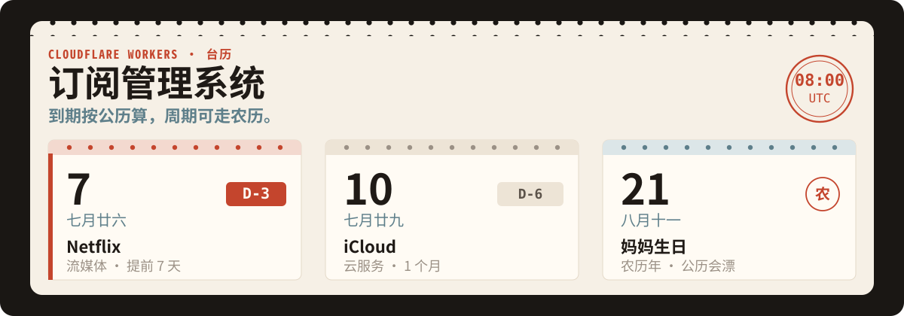
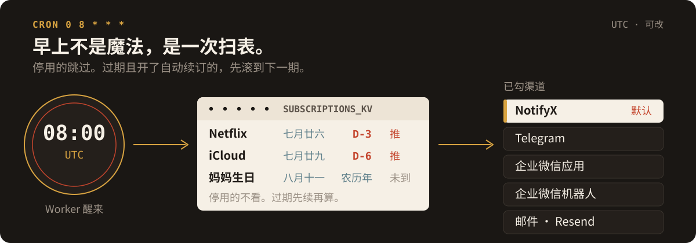
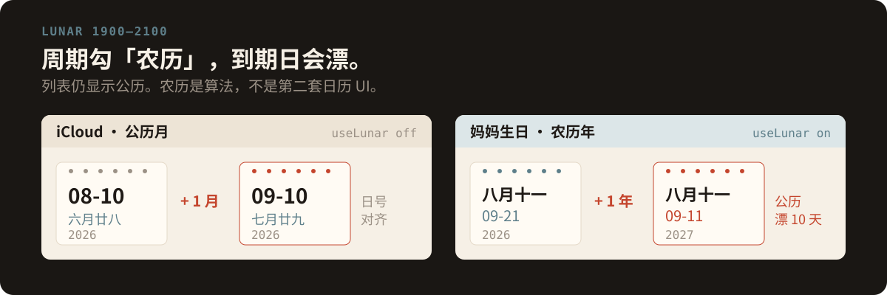

<p align="center">
  
</p>

单文件 Worker。订阅、生日、续费周期写进 KV；每天 `cron` 扫一遍，落在提前提醒窗口里就按你勾的渠道推送。

农历不是装饰。列表可以显示农历，周期还可以**按农历走**——生日停在八月十一，公历日期自己漂。

## 这是什么

管理页在 Worker 里，数据在 `SUBSCRIPTIONS_KV`。一条订阅有：

| 字段 | 作用 |
| --- | --- |
| 名称 / 类型 | 流媒体、云服务、软件、生日… |
| 开始日 + 周期 | 天 / 月 / 年，可自动算出到期日 |
| 提前提醒 | `0` = 只在到期当天；`N` = 提前 N 天开始 |
| 自动续订 | 过期后按周期滚到下一期 |
| 周期按农历 | `useLunar`：用 1900–2100 农历加周期，再转回公历 |

启用 / 停用是开关。停用的条目，定时任务直接跳过。

<p align="center">
  
</p>

## 提醒怎么发

`wrangler.toml` 里是 `0 8 * * *`。Cloudflare cron 用 **UTC**，所以这次触发是 UTC 08:00（北京时间下午 4 点）。要改成自己时区的早上，改 cron，并在系统配置里把时区设成 `Asia/Shanghai` 等——剩余天数按这个时区的午夜算。

渠道可多选，系统配置里各有「测试」按钮：

| 渠道 | 要填的 |
| --- | --- |
| NotifyX（默认勾选） | [NotifyX](https://www.notifyx.cn/) API Key |
| Telegram | [@BotFather](https://t.me/BotFather) token + [@userinfobot](https://t.me/userinfobot) Chat ID |
| 企业微信应用 / 自定义 Webhook | URL；可选 method、JSON 头、模板（`{{title}}` `{{content}}` `{{timestamp}}`） |
| 企业微信机器人 | 群机器人 Webhook；文本或 Markdown；可选 @ 手机号 / @ 所有人 |
| 邮件 | [Resend](https://developers.cloudflare.com/workers/tutorials/send-emails-with-resend/) API Key、已验证发件域名、收件人 |

没填密钥的渠道，勾了也不会发出去。通知里可以带农历。

<p align="center">
  
</p>

## 跑起来

KV 绑定名必须是 `SUBSCRIPTIONS_KV`。本仓库 `wrangler.toml` 里的 `id` 请换成你自己的命名空间。

```bash
npx wrangler kv namespace create SUBSCRIPTIONS_KV
# 把返回的 id 写进 wrangler.toml，然后：
npx wrangler deploy
```

没有 Wrangler 时：在 Cloudflare Dashboard 新建 Worker，粘贴 `index.js`，绑上同名 KV，触发器加上 cron。

打开 `*.workers.dev`：

1. 登录 `admin` / `password`（立刻到系统配置改掉）
2. 选时区，勾通知渠道并点测试
3. 添加一条订阅，设提醒天数

一键部署（会用本仓库作模板）：

[](https://deploy.workers.cloudflare.com/?url=https://github.com/tsumon/subscription-manager)

## 先看清的限制

- 单 Worker、单 KV，没有多用户。
- 默认密码写在代码里，部署后不改等于公开后台。
- 农历范围 1900–2100；闰月由 `lunarCalendar` 处理。
- cron 默认 UTC 08:00，不是北京时间早上 8 点。
- 这是 [wangwangit/SubsTracker](https://github.com/wangwangit/SubsTracker) 的源码导入，许可证 MIT。
